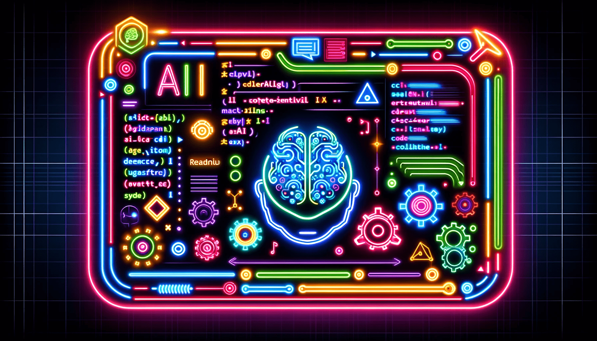

# ChatGPT Code Generation Prompts: Harness AI for Software Development

# ChatGPT Code Generation Prompts

## 🚀 Getting Started
The `prompt.md` file is your starting point for using this project. It contains a collection of curated prompts designed to enhance AI-driven code generation. Check it out to begin exploring the capabilities of AI in coding.

## 📖 Overview
Welcome to the ChatGPT Code Generation Prompts repository, an unparalleled resource for developers seeking to leverage AI coding generators, including AI code generation and AI coder capabilities, to enhance their programming projects. This comprehensive toolkit is designed to optimize the efficiency and effectiveness of generative AI for code, incorporating a wide array of best practices and fundamental concepts in software development, all under the Creative Commons CC0-1.0 license, ensuring maximum freedom for use and contribution.

In the rapidly evolving landscape of software development, the integration of artificial intelligence and machine learning has opened new frontiers for automation and innovation. Generative AI coding, spearheaded by technologies like ChatGPT, offers unprecedented capabilities in generating code from human prompts. The success of AI code generators heavily depends on the specificity and structure of these prompts. Our project addresses this need by providing a curated collection of prompts that guide AI in producing high-quality code, adhering to best practices in AI programming languages.

## ✨ Features
- **Extensive Collection of AI-Optimized Prompts**: From basic syntax to complex algorithmic challenges, our repository covers various domains and programming languages, tailored for artificial intelligence code generators.
- **Best Practices for AI Code Generation**: Each prompt is crafted to ensure that the AI's output meets industry standards, supporting both seasoned AI software developers and those new to using AI for code generation.
- **Community-Driven Contributions**: A collaborative platform where developers can contribute and refine prompts, sharing insights to advance the field of AI coding generators.
- **Generative AI for Code**: Facilitates easy access to prompts, enabling developers to leverage generative AI coding for their projects efficiently.

## 🤝 Contributing
We invite AI software developers, enthusiasts, and anyone interested in AI code generation to contribute to this project. Whether it’s introducing new prompts, enhancing existing ones, or sharing insights on AI programming languages, your contributions are invaluable. Our project is committed to openness and collaboration, made possible by the Creative Commons CC0-1.0 license. See our CONTRIBUTING.md for guidelines on getting involved.

## 🔍 Usage
To harness the power of AI coding generators in your projects, explore the `prompt.md` file in our repository. Select prompts that align with your coding requirements, or modify them for more specific tasks, ensuring your use of generative AI for code is as effective as possible.

## 💖 Acknowledgements
This initiative is powered by the collective effort of developers and AI coding enthusiasts committed to advancing the capabilities of coding AI tools and AI code generators. We are grateful to everyone contributing their expertise to this pioneering project, sharing freely under the Creative Commons CC0-1.0 license to foster innovation and collaboration.

## 📜 License
This project is proudly licensed under the Creative Commons CC0-1.0 License, promoting open collaboration and sharing in the spirit of the free culture movement.

## 📬 Contact
For inquiries, suggestions, or to discuss potential collaborations, please reach us through [GitHub Issues](https://github.com/keypuncherlabs/chatgpt-code-generation-prompts/issues).
